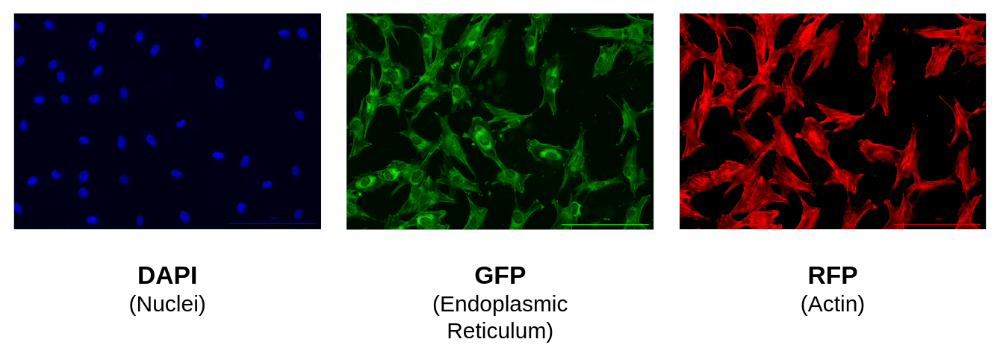

# NF1 Cell Painting Data 

In this repository, we perform the image-based analysis and some analysis of the morphology data.

We train a machine learning model to predict NF1 genotype within a separate repository called: [NF1_SchwannCell_data_analysis](https://github.com/WayScience/NF1_SchwannCell_data_analysis).
Please visit the above repository for further information on the generation and validation of the logistic regression model.

**Note:** All metadata files are located in the [download data module](./0.download_data/). All larger files, including `SQLite` outputs from CellProfiler and `parquet` processed data file from pycytominer, will need to be downloaded using git LFS after the repo is cloned.

## Data

The data we use is a modified Cell Painting assay on [Schwann cells](https://www.ncbi.nlm.nih.gov/books/NBK544316/) from patients with [Neurofibromatosis type 1 (NF1)](https://medlineplus.gov/genetics/condition/neurofibromatosis-type-1/). 

In this modified Cell Painting, there are three channels for plates 1 and 2:

- `DAPI` (Nuclei)
- `GFP` (Endoplasmic Reticulum)
- `RFP` (Actin)



In this modified Cell Painting, there are four channels for plates 3 and 3':

- `DAPI` (Nuclei)
- `GFP` (Endoplasmic Reticulum)
- `CY5` (Mitochondria)
- `RFP` (Actin)


Plates 1 and 2 measure Cell Painting in isogenic Schwann cells with two different NF1 genotypes:

**Plate 1**
- Wild type (`WT +/+`): In column 6 from the plate (e.g C6, D6, etc.)
- Null (`Null -/-`): In column 7 from the plate (e.g C7, D7, etc.)
There are only rows C-F in this plate.


**Plate 2**
- Wild type (`WT +/+`): Columns 1 and 6
- Null (`Null -/-`): Columns 7 and 12
This plate uses all rows (e.g., A-H)


Plates 3 and 3' measure Cell Painting in isogenic Schwann cells with all three different NF1 genotypes:

**Plate 3 and 3'(prime)**
For these plates, we looking at different seeding densities to identify which will lower the cell count contribution on the features and identify differential features between genotypes. 
As well, the plates have different culturing conditions, where plate 3 cells were cultured in 10% FBS versus plate 3 prime culturing in 5% FBS.
- Wild type (`WT +/+`): Columns 1-3
- Heterzygous (`HET +/-`): Columns 5-7
- Null (`Null -/-`): Columns 9-11
- Seeding density:
  - 500 -> Columns 1, 5, and 9
  - 1000 -> Columns 2, 6, and 10
  - 2000 -> Columns 3, 7, and 11
  - 4000 -> Columns 4, 8, and 12


**Plate 4**
For plate 4, we will be looking at how using different siRNA constructs to downregulate neurofibromin production in NF1 WT cells impacts the morphology as dose increases. 
We will be able to compare this to controls (e.g., untreated WT and Null cells).

The cells were cultured in 5% FBS.


There are 8 replicates of NF1 Null cells and the rest of the wells contain NF1 WT cells.


There are three different siRNA constructs used in this plate, all with the same dose curve from 0.001 nM - 0.1 nM.
Any well with a 0 nM concentration are not treated with a construct.

## Goal

It is important to study Schwann cells from NF1 patients because NF1 causes patients to develop neurofibromas, which are peripheral nerve tumors forming bumps underneath the skin that appear due to the decrease of Ras-GAP neurofibromin production. 
This decrease in production occurs when the NF1 gene is mutated (NF1 +/-).

**The goal of this project is to predict NF1 genotype from Schwann cell morphology.**
We apply cell image analysis to Cell Painting images and use representation learning to extract morphology features.
We will apply machine learning to the morphology features to discover a biomarker of NF1 genotype.
Once we discover a biomarker from these cells, we hope that our method can be used for drug discovery to treat this rare disease.

## Repository Structure

| Module | Purpose | Description |
| :---- | :----- | :---------- |
| [0.download_data](./0.download_data/) | Download NF1 data | We download images from each plate of the NF1 dataset for analysis from Figshare |
| [1.cellprofiler_ic](./1.cellprofiler_ic/) | Apply CellProfiler illumination correction (IC)| We use a CellProfiler pipeline to calculate and apply IC the images and save them |
| [2.cellprofiler_analysis](./2.cellprofiler_analysis/) | Perform CellProfiler analysis on corrected images | We use a CellProfiler pipeline to segment single cells and extract features into a SQLite file |
| [3.processing_features](./3.processing_features/) | Process CellProfiler SQLite files | We use CytoTable to convert extracted features from SQLite files to parquet files. We then use pycytominer to annotate, normalize, and feature select profiles |
| [4.analyze_data](./4.analyze_data/) | Perform various analysis of morphology data | Using different statistical methods, like linear modeling, we analyze the data to assess the difference in morphology between genotypes |

## Main environment

For all modules, we use one main environment for the repository, which includes all packages needed including installing CellProfiler v4.2.4.

To create the environment, run the below code block:

```bash
# Run this command in terminal to create the conda environment
conda env create -f nf1_cellpainting_env.yml
```

**Make sure that the conda environment is activated before running notebooks or scripts:**

```bash
conda activate nf1_cellpainting_data
```
